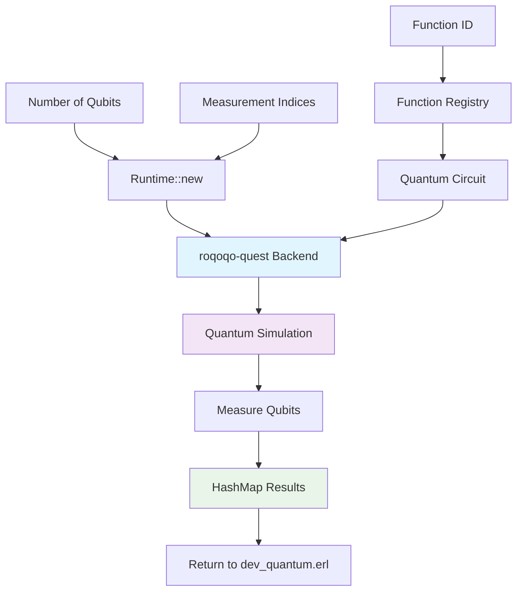

## About

The `quantum_runtime_nif` is the foundation of the `~quantum-rt@1.0` device: a quantum computing runtime built on top of roqoqo simulation framework. This hyperbeam device enables serverless quantum function execution, positioning hyperbeam nodes running this device as providers of serverless functions compute. 

The device supports quantum circuit execution, measurement-based quantum computation, and provides a registry of pre-built quantum functions including superposition states, quantum random number generation, and quantum teleportation protocols.

***[!] This device is currently simulation-based using roqoqo-quest backend - for educational purposes only [!]***

### What is Quantum Computing?

Quantum computing make use of quantum mechanical phenomena such as superposition and entanglement to process information in fundamentally different ways than classical computers.

Unlike classical bits that exist in definite states (0 or 1), quantum bits (qubits) can exist in superposition of both states simultaneously, enabling parallel computation across multiple possibilities.

## ~quantum-rt@1.0 device

The `~quantum-rt@1.0` device, as per its current implementation, provides a serverless quantum function execution environment. It uses the roqoqo simulation backend for development and testing, but can be adapted to real quantum computation using services like [AQT.eu](https://aqt.eu) or other quantum cloud providers such as IBM Quantum Platform, with minimal device code changes.

The device supports quantum circuits with up to 32 qubits and provides a registry of whitelisted quantum functions that can be executed through HTTP calls or via ao messaging.

### Available Quantum Functions (in simulation mode)

- **superposition**: creates quantum superposition state on a single qubit
- **quantum_rng**: quantum (pseuo)random number generator using multiple qubits
- **bell_state**: creates entangled Bell states between qubits
- **quantum_teleportation**: implements quantum teleportation protocol

## Quantum Runtime Technical Architecture

```rust
#[rustler::nif]
fn hello() -> NifResult<String> {
    Ok("Hello world!".to_string())
}

#[rustler::nif(schedule = "DirtyCpu")]
fn compute(
    num_qubits: usize,
    function_id: String,
    measurements: Vec<usize>,
) -> NifResult<HashMap<String, f64>> {
    let runtime = Runtime::new(num_qubits);
    match runtime.execute_serverless(function_id, measurements) {
        Ok(result) => Ok(result),
        Err(_) => Err(rustler::Error::Term(Box::new("execution failed"))),
    }
}
```

The compute() function takes 3 inputs: the number of qubits to initialize, a function ID from the serverless registry, and a list of qubit indices to measure. It returns a HashMap containing the measurement results.



## Device API Examples

#### Generate Quantum Random Numbers

```bash
curl -X POST "https://hb.load.rs/~quantum-rt@1.0/compute" \
  -H "Content-Type: application/json" \
  -d '{
    "function_id": "quantum_rng",
    "num_qubits": 4,
    "measurements": [0, 1, 2, 3]
  }'
```

## References

- hb device interface: [dev_quantum.erl](../../src/dev_quantum.erl)
- nif interface: [quantum_runtime_nif.erl](../../src/quantum_runtime_nif.erl)
- quantum functions registry: [registry.rs](./src/core/registry.rs)
- runtime core: [runtime.rs](./src/core/runtime.rs)

## License
This device is licensed under the [MIT License](./LICENSE)
