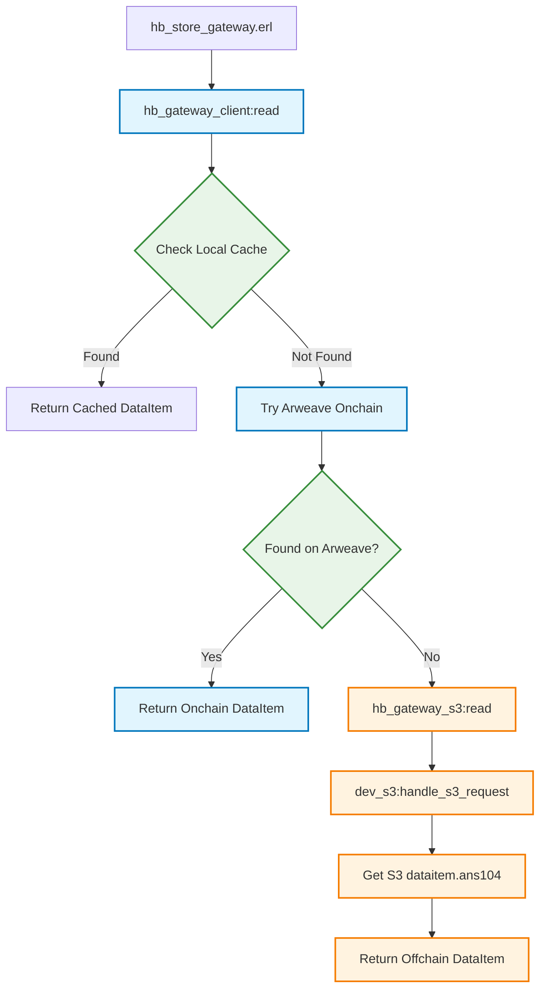

## About
s3 hyperbeam device

> MVP - WIP

## Setup

### 1- add s3_device.config

in the root level of the hyperbeam codebase, `touch s3_device.config` and add the creds to connect to your S3 cluster

#### connecting to external s3 cluster (`./build.sh`)

```config
{endpoint, <<"https://s3.load.rs">>}.
{access_key_id, <<"load_acc_XLrIyYcF6vdwr9tiug2wrLRSuSPmtucZ">>}.
{secret_access_key, <<"your_access_key">>}.
{region, <<"eu-west-2">>}.
```

#### connecting to local minio s3 cluster (`./s3_device.sh`)

```config
{endpoint, <<"http://localhost:9001">>}.
{access_key_id, <<"value">>}.
{secret_access_key, <<"value">>}.
{region, <<"value">>}.
```

### build and run the hyperbeam node 

```bash
./s3_device.sh # build the s3_nif device & run local minio cluster

# if you want to connect to external s3 cluster, run ./build.sh instead

rebar3 compile

erl -pa _build/default/lib/*/ebin 

1> application:ensure_all_started(hb).
```

### configurting the local minio cluster
if you choose the local minio cluster route, you can configure (set) your access key id and secret access key [by creating .env file here](../../minio-cluster):

```.env
MINIO_ROOT_USER=access_key_id
MINIO_ROOT_PASSWORD=secret_access_key
```

> N.B: your local minio cluster access keys values should be also set equally in the `s3_device.config` config file

## Supported methods

| Supported  | 
| :-------------: |
| `create_bucket`| 
|`head_bucket`|
| `put_object` (expport `expiry: 1-365 days`)| 
| `get_object` (support range)|
|`delete_object`|
|`delete_objects`|
|`head_object`|
|`list_objects`|


## Use the ~s3@1.0 device

After running the hyperbeam node with the `~s3@1.0` device, you can use the `node_endpoint/~s3@1.0` url as a S3 compatible API endpoint.

> ***N.B (regarding access authorization): using the `~s3@1.0` as end user (client) you only have to pass the `accessKeyId` in the request's credentials, and `secretAccessKey` value doesn't matter. This is due to the design of `~s3@1.0` access authorization where the device check's the S3 request's access_key_id of Authorization Header, and validate its parity with the access_key_id defined in `s3_device.config` -> Keep the `access_key_id` secret and use it as access API key.***

### 1- create s3 client

```js
import { S3Client } from "@aws-sdk/client-s3";

const accessKeyId = "your-access-key";
const secretAccessKey = ""; // intentionally empty

const s3Client = new S3Client({
  region: "eu-west-2",
  endpoint: "http://localhost:8734/~s3@1.0",
  credentials: {
    accessKeyId,
    secretAccessKey,
  },
  forcePathStyle: true,
});
```

### 2- create bucket

```js
async function createBucket(bucketName) {
    try {
        const command = new CreateBucketCommand({ Bucket: bucketName });
        const result = await s3Client.send(command);
        console.log("Bucket created:", result.Location || bucketName);
    } catch (error) {
        console.error("Error creating bucket:", error);
    }
}
```

### 3- get object (with range)


```js
async function getObject(bucketName, key) {
  try {
    console.log(`Getting object: ${bucketName}/${key}`);

    const command = new GetObjectCommand({
      Bucket: bucketName,
      Key: key,
      Range: "bytes=-1",
    });

    const result = await s3Client.send(command);

    const bodyContents = await result.Body.transformToString();

    console.log("Object retrieved successfully!");
    console.log("Content:", bodyContents);
    console.log("Metadata:", {
      ContentType: result.ContentType,
      ContentLength: result.ContentLength,
      ETag: result.ETag,
      LastModified: result.LastModified,
    });

    return result;
  } catch (error) {
    console.error("Error getting object:", error.name, error.message);
    throw error;
  }
}
```

### 4- put object (with expiry)
```js
async function PutObject(bucketName, fileName, body, expiryDays) {
  try {
    const command = new PutObjectCommand({
      Bucket: bucketName,
      Key: fileName,
      Body: body,
      Metadata: {
        "expiry-days": expiryDays.toString(),
      },
    });

    const result = await s3Client.send(command);
    console.log("Object created:", fileName, "with expiry:", expiryDays);
    return result;
  } catch (error) {
    console.error("Error creating object", error);
  }
}
```

## Cache layer
The NIF implements an LRU cache with size-based eviction (in-memory). The following cache endpoints are available under the hyperbeam http api (intentionally not compatible with the S3 API spec):

### 1- get cached object

***Note: This endpoint requires no authentication***

```bash
curl "http://localhost:8734/~s3@1.0/cache/BUCKET_NAME/OBJECT_KEY"
```

> cache vs S3 API `GetObjectCommand` : `curl "http://localhost:8734/~s3@1.0/BUCKET_NAME/OBJECT_KEY"`

## Hybrid gateway
The hybdrid gateway is an extension to the `hb_gateway_client.erl` that makes it possible for the hyperbeam node to retrieve both of onchain (Arweave) posted ANS-104 dataitems, and offchain (in `dev_s3.erl`) object-storage temporal dataitems.

### Workflow

- `hb_store_gateway.erl` -> calls `hb_gateway_client:read()` -> it tries to read from local cache then Arweave *(onchain dataitem)* -> *incase not found onchain, check the offchain dataitems s3 bucket*

- *offchain dataitems retrieval route* : `hb_gateway_s3:read()` -> calls `dev_s3:handle_s3_request()` -> retrieve the dataitem.asn104 from the `dev_s3` bucket


> To check the order of dataitem hits, check the commented code [here](https://github.com/loadnetwork/load_hb/blob/s3-edge/src/hb_opts.erl#L180)
### Test it

#### 1- create & set the offchain bucket
Make hyperbeam aware of the `dev_s3` bucket that is storing your ANS-104 offchain dataiems, here [../../src/hb_opts.erl] (`s3_bucket` in `default_message`)

```erlang
s3_bucket => <<"offchain-dataitems">> % you can change the name
```

#### 2- add test data

Make sure to create the `~s3@1.0` bucket as you defined the name in `hb_opts.erl` then add a fake offchain dataitem. If you want to test using existing signed offchain ans-104 dataitems, checkout the [test-dataitems](../../test-dataitems/) directory and store it in your `~s3@1.0` bucket.

```bash
curl -X PUT "http://localhost:8734/~s3@1.0/offchain-dataitems/dataitems/ysAGgm6JngmOAxmaFN2YJr5t7V1JH8JGZHe1942mPbA.ans104" \
  -H "Content-Type: application/octet-stream" \
  -H "Authorization: AWS4-HMAC-SHA256 Credential=YOUR_ACCESS_KEY_ID/20250119/us-east-1/s3/aws4_request, SignedHeaders=host;x-amz-date, Signature=dummy" \
  --data-binary @ysAGgm6JngmOAxmaFN2YJr5t7V1JH8JGZHe1942mPbA.ans104
```
Otherwise, you can generate a signed valid ANS-104 dataitem using the hyperbeam erlang shell:

```erlang
1> TX = #tx{data = <<"Hello Load S3">>, tags = [{<<"Content-Type">>, <<"text/plain">>}], format = ans104}.
2> SignedTX = ar_bundles:sign_item(TX, hb:wallet()).
3> ANS104Binary = ar_bundles:serialize(SignedTX).
4> DataItemID = hb_util:encode(hb_tx:id(SignedTX, signed)).
5> file:write_file("TheDataItemId.ans104", ANS104Binary).

% After that, store the dataitem on s3 as we did previously or using the s3 sdk/client of your choice.
```

### 3- test retrieving dataitems

- offchain: http://localhost:8734/ysAGgm6JngmOAxmaFN2YJr5t7V1JH8JGZHe1942mPbA

- onchain: http://localhost:8734/myb2p8_TSM0KSgBMoG-nu6TLuqWwPmdZM5V2QSUeNmM

#### Verify dataitem integrity

```bash
curl -I "http://localhost:8734/ysAGgm6JngmOAxmaFN2YJr5t7V1JH8JGZHe1942mPbA"
```

#### Expected Response:

```bash
HTTP/1.1 200 OK
Content-Type: text/plain
Data-Protocol: ao
Device-Test: ~s3@1.0
access-control-allow-methods: GET, POST, PUT, DELETE, OPTIONS
access-control-allow-origin: *
access-control-expose-headers: *
ao-body-key: data
ao-types: status="integer"
content-digest: sha-256=:9WV5g4vLNkDev2JHfurtl5OE4XrCfKwjf4zE9SceHyg=:
date: Fri, 18 Jul 2025 15:24:11 GMT
id: ysAGgm6JngmOAxmaFN2YJr5t7V1JH8JGZHe1942mPbA
owner: q4VxGIPsOoT2ce5OsF0eSErdxuMtFexE9tUvY_Gl1tE-w3p6YRy6REuc4t2gDFUFE233PP8l5B-db6a2IzRw8FrEc7eFeu_-sWi-FTnkh3EQ3ExE6D9VpBaocSwlPJmVXGMfC64kkxy1hrh44qpQl-RwI52IP15J5YTLWN_XOzGqPCL94VPRFQtwhiK2FQkAx1iCDCtC_FUWC9CitUnNygTUAt2X5I1oD_e9zoyWyUuEp14TLM0-JDnBzGW1t0BbZZKUw8nvmjkqyErQXOHU4AbSevp7rmb3kmi0qFEqb85flF11sHvl1ABJ9i84cmYOM4Az87Gw5beVdzIwe_1tnlUOdX42-skOuNwNPoSOOrUOXh78_meoHCWk5iwYXCnFIWOdlXl-i9Ts2MCf1Ub0v7UPeLT4mtbdhRyG6iK6nokFGHs6A5t1nce0ItGAO1wpBs_4zK3qwfxKvNwoIHpJARyBof8IKnrr28-RpkNJyhVCRvNueUusANnWNk8zIjWseNF3zLg2w_IxZKrDb7a7u1RDQGHSxDvX8mHNHZKAUcqUVeQau8pyfOcDw7hRPKLPkcoCv28ZusAeS0hibdIXA0CJ0HXzleNLIJhCBGwEmo_n1Fa1_hIEekGKnztkNwtLbhyfLtFuqbT6o_r9LdQ81glhAccc-_OJeTvG-fsYD3s
server: Cowboy
signature: sig-ahm9fs6tg1al3sq0w-ttpxaba2ztt2by1xnq1f4ih6w=:HGS0k2orTq+gA8t7zNx3ykTwn/lyagXlIB3yWX9AGu+yrLK1klrXo2mbySD3Kglmxw2Wyolj42CiGx4yYqAtvhN9AtS3HwVqf47E2FhmcQYk6dcfdAxaJcEz1lXncSyDAAwT7R/ecqJHHNWqOGHiP/9I9V4gCH6qz+kxXI6y/Z5Nnf9IWuJ8xv8XY37TICHlU8oPnPuLPFuvOVPCUXrzCxR6jP8JaVmx5kAHhMMC60+3CDKc3auoe9uxhMQlshnCShD1J/EzycwVqbfXV7TprqVRJoox/Z9EYdd36QKe303dgb3hO/s2aH/Z8TwLJEz6X0c9Miyt31pRQK+31Ev9QwAeXUbE48KljS/knfpTvNA0gjNIQ6xoz9paLWoHhZ+Ntzp/6fC0amzRZcXD1d5cZ5wxRUp1PUSnkexdi73adYV6UKL9pG4NRtDXpx1rP8H33qV5a7JKnTUrcg7TTuwgtieoB+ZKgAGPPtZUYsTRehSkW3gHFujpO+DsNko3UfhveXk5FpONKm2J+22LoOmLp13/yHdiRoHOIr+W/iPD7ueM3iSxtJFO68Wx6qIWp5PV0L+/trU/nHnDYxCgFNE/lZQvINeBSR8mKfE6ws1MJqoGdOC4ZdcRK11Bk75bjlWZUoz4r9JJGQgaA92xwqGzpWRQzAjGWs4rxhCib8YXLqE=:, sig-iq1nxhxgfzszd_rdcs-qwa_csljm7qwvdxmjr3mca7g=:f4/xQHH6IHbhDg3xIGKd7IRIXmwsrUd4a8XaBmKIRco=:
signature-input: sig-ahm9fs6tg1al3sq0w-ttpxaba2ztt2by1xnq1f4ih6w=("Content-Type" "Data-Protocol" "Device-Test" "ao-body-key" "ao-types" "content-digest" "id" "owner" "signature" "signature-input" "status" "tags+link");alg="rsa-pss-sha512";keyid="q4VxGIPsOoT2ce5OsF0eSErdxuMtFexE9tUvY/Gl1tE+w3p6YRy6REuc4t2gDFUFE233PP8l5B+db6a2IzRw8FrEc7eFeu/+sWi+FTnkh3EQ3ExE6D9VpBaocSwlPJmVXGMfC64kkxy1hrh44qpQl+RwI52IP15J5YTLWN/XOzGqPCL94VPRFQtwhiK2FQkAx1iCDCtC/FUWC9CitUnNygTUAt2X5I1oD/e9zoyWyUuEp14TLM0+JDnBzGW1t0BbZZKUw8nvmjkqyErQXOHU4AbSevp7rmb3kmi0qFEqb85flF11sHvl1ABJ9i84cmYOM4Az87Gw5beVdzIwe/1tnlUOdX42+skOuNwNPoSOOrUOXh78/meoHCWk5iwYXCnFIWOdlXl+i9Ts2MCf1Ub0v7UPeLT4mtbdhRyG6iK6nokFGHs6A5t1nce0ItGAO1wpBs/4zK3qwfxKvNwoIHpJARyBof8IKnrr28+RpkNJyhVCRvNueUusANnWNk8zIjWseNF3zLg2w/IxZKrDb7a7u1RDQGHSxDvX8mHNHZKAUcqUVeQau8pyfOcDw7hRPKLPkcoCv28ZusAeS0hibdIXA0CJ0HXzleNLIJhCBGwEmo/n1Fa1/hIEekGKnztkNwtLbhyfLtFuqbT6o/r9LdQ81glhAccc+/OJeTvG+fsYD3s=", sig-iq1nxhxgfzszd_rdcs-qwa_csljm7qwvdxmjr3mca7g=("Content-Type" "Data-Protocol" "Device-Test" "ao-body-key" "ao-types" "content-digest" "id" "owner" "signature" "signature-input" "status" "tags+link");alg="hmac-sha256";keyid="ao"
status: 200
tags+link: 24Xx7HqIQkRzm3CtNQxfht5RbHTz12N1Ihwm1B0IIFE
transfer-encoding: chunked
```

## License
This repository is licensed under the [MIT License](./LICENSE)