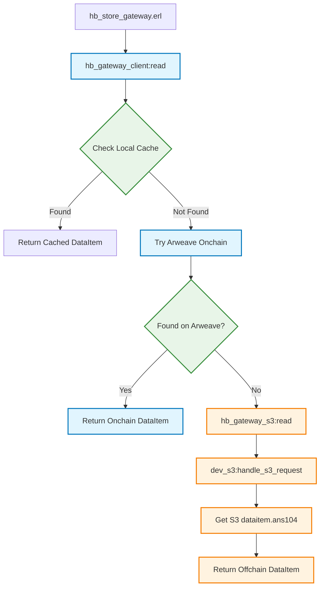

## About
s3 hyperbeam device

> MVP - WIP

## Setup

### 1- add s3_device.config

in the root level of the hyperbeam codebase, `touch s3_device.config` and add the creds to connect to your S3 cluster

#### connecting to external s3 cluster (`./build.sh`)

```config
{endpoint, <<"https://s3.load.rs">>}.
{access_key_id, <<"load_acc_XLrIyYcF6vdwr9tiug2wrLRSuSPmtucZ">>}.
{secret_access_key, <<>>}.
{region, <<"eu-west-2">>}.
```

#### connecting to local minio s3 cluster (`./s3_device.sh`)

```config
{endpoint, <<"http://localhost:9001">>}.
{access_key_id, <<"value">>}.
{secret_access_key, <<"value">>}.
{region, <<"value">>}.
```

### build and run the hyperbeam node 

```bash
./s3_device.sh # build the s3_nif device & run local minio cluster

# if you want to connect to external s3 cluster, run ./build.sh instead

rebar3 compile

erl -pa _build/default/lib/*/ebin 

1> application:ensure_all_started(hb).
```

### configurting the local minio cluster
if you choose the local minio cluster route, you can configure (set) your access key id and secret access key [by creating .env file here](../../minio-cluster):

```.env
MINIO_ROOT_USER=access_key_id
MINIO_ROOT_PASSWORD=secret_access_key
```

> N.B: your local minio cluster access keys values should be also set equally in the `s3_device.config` config file

## Supported methods

| Supported  | 
| :-------------: |
| `create_bucket`| 
|`head_bucket`|
| `put_object`| 
| `get_object`|
|`delete_object`|
|`delete_objects`|
|`head_object`|
|`list_objects`|


## Use the ~s3@1.0 device

After running the hyperbeam node with the `~s3@1.0` device, you can use the `node_endpoint/~s3@1.0` url as a S3 compatible API endpoint.

### 1- create s3 client

```js
import { S3Client } from "@aws-sdk/client-s3";

const accessKeyId = "load_acc_XLrIyYcF6vdwr9tiug2wrLRSuSPmtucZ";
const secretAccessKey = "";

const s3Client = new S3Client({
  region: "eu-west-2",
  endpoint: "http://localhost:8734/~s3@1.0",
  credentials: {
    accessKeyId,
    secretAccessKey,
  },
  forcePathStyle: true,
});
```

### 2- create bucket

```js
async function createBucket(bucketName) {
    try {
        const command = new CreateBucketCommand({ Bucket: bucketName });
        const result = await s3Client.send(command);
        console.log("Bucket created:", result.Location || bucketName);
    } catch (error) {
        console.error("Error creating bucket:", error);
    }
}
```

## Cache layer
The NIF implements an LRU cache with size-based eviction (in-memory). The following cache endpoints are available under the hyperbeam http api (intentionally not compatible with the S3 API spec):

### 1- get cached object

```bash
curl "http://localhost:8734/~s3@1.0/cache/BUCKET_NAME/OBJECT_KEY"
```

> cache vs S3 API `GetObjectCommand` : `curl "http://localhost:8734/~s3@1.0/BUCKET_NAME/OBJECT_KEY"`

## Hybrid gateway
The hybdrid gateway is an extension to the `hb_gateway_client.erl` that makes it possible for the hyperbeam node to retrieve both of onchain (Arweave) posted ANS-104 dataitems, and offchain (in `dev_s3.erl`) object-storage temporal dataitems.

### Workflow

- `hb_store_gateway.erl` -> calls `hb_gateway_client:read()` -> it tries to read from local cache then Arweave *(onchain dataitem)* -> *incase not found onchain, check the offchain dataitems s3 bucket*

- *offchain dataitems retrieval route* : `hb_gateway_s3:read()` -> calls `dev_s3:handle_s3_request()` -> retrieve the dataitem.asn104 from the `dev_s3` bucket



### Test it

#### 1- create & set the offchain bucket
Make hyperbeam aware of the `dev_s3` bucket that is storing your ANS-104 offchain dataiems, here [../../src/hb_opts.erl] (`s3_bucket` in `default_message`)

```erlang
s3_bucket => <<"offchain-dataitems">> % you can change the name
```

#### 2- add test data

Make sure to create the `~s3@1.0` bucket as you defined the name in `hb_opts.erl` then add a fake offchain dataitem:

```bash
# Rbb0M8_TSM0KSgBMoG-nu6TLuqWwPmdZM5V2QSUeNmM is a fake dataitem that does not exist on Arweave. Try https://arweave.net/Rbb0M8_TSM0KSgBMoG-nu6TLuqWwPmdZM5V2QSUeNmM to verify

# Add fake offchain ANS-104 dataitem to our s3 bucket
curl -X PUT "http://localhost:8734/~s3@1.0/offchain-dataitems/dataitems/Rbb0M8_TSM0KSgBMoG-nu6TLuqWwPmdZM5V2QSUeNmM.ans104" \
  -H "Content-Type: application/json" \
  -d '{
    "id": "Rbb0M8_TSM0KSgBMoG-nu6TLuqWwPmdZM5V2QSUeNmM",
    "data": "<html><head><title>my website</title></head><body bgcolor=\"#f5f5f5\"><table width=\"600\" align=\"center\" cellpadding=\"20\"><tr><td bgcolor=\"white\"><h2>Welcome to my site</h2><p>This is just a simple test page. Nothing fancy here.</p><p>I built this to test some stuff with hyperbeam and s3 storage.</p><hr><p><small>Last updated: July 2025</small></p></td></tr></table></body></html>",
    "tags": [
      {"name": "Content-Type", "value": "text/html"},
      {"name": "Data-Protocol", "value": "ao"}
    ],
    "owner": "test",
    "signature": "abc123"
  }'

```

### 3- test retrieving dataitems

- offchain: http://localhost:8734/Rbb0M8_TSM0KSgBMoG-nu6TLuqWwPmdZM5V2QSUeNmM

- onchain: http://localhost:8734/myb2p8_TSM0KSgBMoG-nu6TLuqWwPmdZM5V2QSUeNmM

 
## License
This repository is licensed under the [MIT License](./LICENSE)